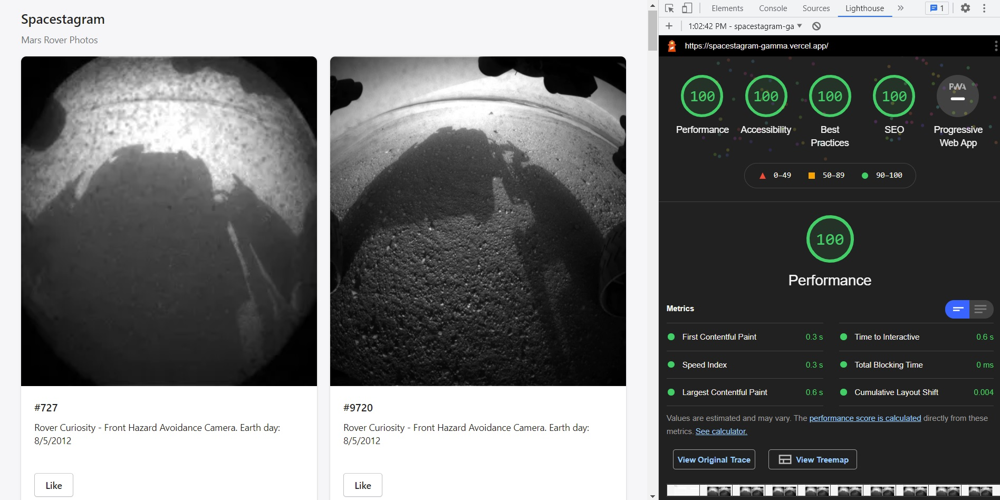

# Spacestagram :rocket:

This is a submission for [Shopify Challenge Winter 2022](https://www.shopify.ca/careers/frontend-developer-intern-remote-winter-2022-6932cbed). A curated list of images from [NASA Open API - Mars Rover Photos](https://api.nasa.gov/).

Demo link: [https://spacestagram-gamma.vercel.app/](https://spacestagram-gamma.vercel.app/)


## Features :fire:

:sparkles: Display images from Mars Rover Photos API

:sparkles: Like and unlike images.

:sparkles: Persist liked images on page refresh

:sparkles: Loading skeletons

Core web vitals:



## Navigates the project :dizzy:

The structure is inspired by [Bulletproof React](https://github.com/alan2207/bulletproof-react).

```
src
|
+-- app           # global Redux store
|
+-- context       # project-wide React contexts
|
+-- lib           # third-party libraries
|
+-- modules       # feature based modules
|
+-- pages         # Next.js preserved dir for pages
|   |
|   +-- api       # Next.js serverless functions with REST standard
|
+-- ui            # project-wide components
|
+-- utils         # project-wide utilities
```

```
src
|
+-- modules
    |
    +-- mars-rover-photos
        |
        +-- api               # typed axios calls
        |
        +-- components        # feature-related components
        |
        +-- hooks             # custom hooks
        |
        +-- model             # object schemas
        |
        +-- slice             # Redux slices
        |
        +-- service           # typed database calls
        |
        +-- utils             # feature-related utilities
```

:star2: Silky smooth `TResult<Data>` system that I have improved over many Next.js projects [@common.d.ts](https://github.com/Andrewnt219/spacestagram/blob/main/%40types/%40common.d.ts), [api-utils](https://github.com/Andrewnt219/spacestagram/blob/main/src/utils/api-utils.ts), [with-api-handler](https://github.com/Andrewnt219/spacestagram/blob/main/src/utils/with-api-handler.ts)

:star2: Backend for fetching photos: [photos.ts](https://github.com/Andrewnt219/spacestagram/blob/main/src/pages/api/photos.ts)

:star2: Backend for liking a photo: [like.ts](https://github.com/Andrewnt219/spacestagram/blob/main/src/pages/api/photo/like.ts)

:star2: Backend for unliking a photo: [unlike.ts](https://github.com/Andrewnt219/spacestagram/blob/main/src/pages/api/photo/unlike.ts)

:star2: Reducers for fetching photos, toggling like: [photos-slice.ts](https://github.com/Andrewnt219/spacestagram/blob/main/src/modules/mars-rover-photos/slice/photos-slice.ts)

## Technical decisions :collision:

:exclamation: I chose to implement [`/api/photo/like`](https://github.com/Andrewnt219/spacestagram/blob/main/src/pages/api/photo/like.ts) (POST) and [`/api/photo/unlike`](https://github.com/Andrewnt219/spacestagram/blob/main/src/pages/api/photo/unlike.ts) (DELETE) over `/api/photo/toggleLike` (GET) because it made more sense for RESTful API. It also helped differentiate Redux actions, and avoided having flagged paths in all the codes that call it (single-responsibility principle).

:exclamation: POST [`/api/photos`](https://github.com/Andrewnt219/spacestagram/blob/main/src/pages/api/photos.ts) responses with `favorited_photos` and `nonfavorited_photos` rather than putting `isFavorited` inside [`MarsRoverPhoto`](https://github.com/Andrewnt219/spacestagram/blob/main/%40types/%40mars-rover-photos-api.d.ts) schema. The decision was made to avoid cluttering schemas with another model like `MarsRoverPhotoWithFavorite`, but still keep the flexibility for the frontend to put `isFavorited` inside with `map()` for example.
